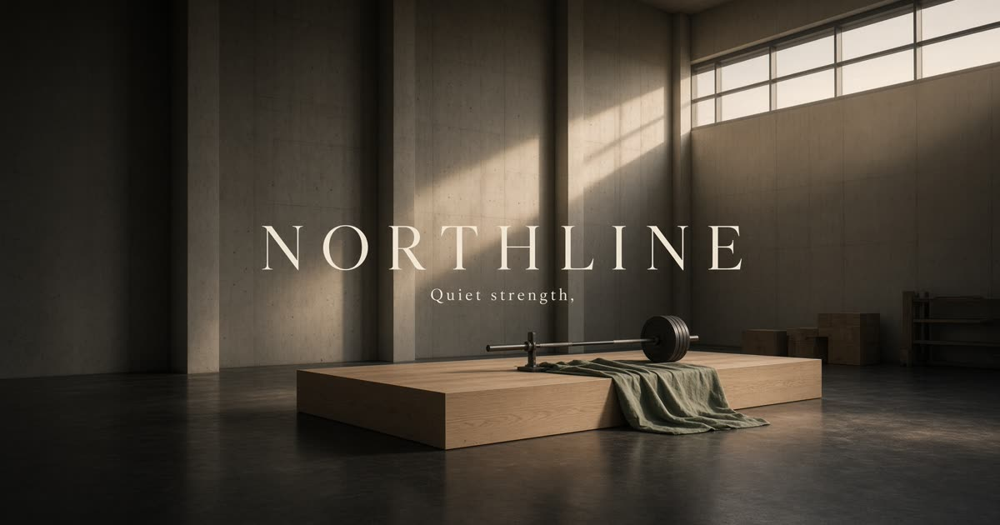

<div align="center">



<br/>

# **NORTHLINE**

### *Quiet strength.*

**The modern operating system for personal training.**

<br/>


<br/>

[Get Started](#quick-start) · [Features](#what-you-get) · [Programs](#training-programs) · [Deploy](#deployment)

</div>

---

<br/>

> *"The best coaches don't need more hours in the day. They need fewer distractions between them and their athletes."*

<br/>

## Why Northline?

The fitness industry runs on a broken stack. Coaches juggle WhatsApp threads for programming, Google Sheets for tracking, Calendly for scheduling, and Venmo for payments. Athletes bounce between apps that don't talk to each other. Nobody wins.

**Northline replaces the patchwork with a single, cohesive platform** — built by coaches, for coaches, powered by modern technology that disappears into the background.

<br/>

<div align="center">


*Where technology meets training.*

</div>

<br/>

---

<br/>

## What You Get

<table>
<tr>
<td width="50%" valign="top">

### For Athletes

- **Training Sessions** — Follow periodized programs with real-time set logging, rest timers, and RPE tracking
- **Progress Dashboard** — Visualize strength gains, consistency, and trends over weeks and months
- **Direct Messaging** — Talk to your coach without leaving the platform
- **Smart Scheduling** — Book sessions with built-in calendar sync
- **Weekly Check-ins** — Share recovery status so your coach can adjust your program

</td>
<td width="50%" valign="top">

### For Coaches

- **Client Dashboard** — See every athlete's training status, adherence, and feedback at a glance
- **Program Builder** — Create custom workouts from 100+ exercises with sets, reps, RPE, and tempo
- **AI Assistant** — Powered by xAI's Grok — generate summaries, suggestions, and communications
- **Assessment Tracking** — Record body composition, mobility, and strength benchmarks
- **Availability Management** — Handle 1-on-1s, group sessions, and open slots

</td>
</tr>
</table>

<br/>

<div align="center">


*Built for coaches who demand more.*

</div>

<br/>

---

<br/>

## Built Different

<br/>

| Capability | Traditional Tools | Northline |
|:---|:---|:---|
| **Training Logs** | Paper, spreadsheets | Real-time logging with history |
| **Communication** | WhatsApp, email, SMS | Integrated messaging with context |
| **Programming** | Static PDFs | Dynamic builder + AI suggestions |
| **Progress Tracking** | Manual check-ins | Automated dashboards & trends |
| **Scheduling** | Calendly + manual sync | Built-in booking with availability |
| **Client Oversight** | Guesswork | Dashboard with adherence metrics |
| **Payments** | Venmo, invoices | Integrated billing (coming soon) |

<br/>

---

<br/>

## Training Programs

Five periodized programs designed by certified coaches — each with full workout templates, exercise progressions, and deload protocols.

<br/>

<div align="center">


*Science-backed programming. Period.*

</div>

<br/>

<div align="center">
<table>
<tr>
<td align="center" width="25%">
<br/>
<b>Foundation</b><br/>
<sub>8 weeks · Movement quality</sub>
</td>
<td align="center" width="25%">
<br/>
<b>Strength</b><br/>
<sub>10 weeks · Max strength</sub>
</td>
<td align="center" width="25%">
<br/>
<b>Performance</b><br/>
<sub>12 weeks · Athletic power</sub>
</td>
<td align="center" width="25%">
<br/>
<b>Rebuild</b><br/>
<sub>8 weeks · Recovery</sub>
</td>
</tr>
</table>
</div>

<br/>

---

<br/>

## Architecture

<br/>

<div align="center">


*Engineered from the ground up.*

</div>

<br/>

```
┌─────────────────────────────────────────────────────────┐
│                     CLIENT LAYER                        │
│   React 19 · TanStack Start · Tailwind v4 · Radix UI   │
├─────────────────────────────────────────────────────────┤
│                    SERVER LAYER                         │
│      TanStack Server Functions · Zod · Better Auth      │
├─────────────────────────────────────────────────────────┤
│                      AI LAYER                           │
│            xAI Grok · Session Summaries                 │
│         Program Suggestions · Communication Drafts      │
├─────────────────────────────────────────────────────────┤
│                     DATA LAYER                          │
│        PostgreSQL (Neon) · PGLite (Local Dev)           │
│              OAuth · Email/Password                     │
├─────────────────────────────────────────────────────────┤
│                    INFRA LAYER                          │
│           Vercel · Fly.io · GitHub Actions              │
└─────────────────────────────────────────────────────────┘
```

<br/>

---

<br/>

## Tech Stack

<br/>

<div align="center">

| Layer | Technology |
|:---|:---|
| **Frontend** | React 19 · TanStack Start · TanStack Query · TanStack Router |
| **Styling** | Tailwind CSS v4 · Radix UI · CVA · Sonner |
| **Backend** | TanStack Server Functions · Zod · Better Auth |
| **Database** | PostgreSQL (Neon) · PGLite (local fallback) |
| **AI** | xAI Grok API |
| **State** | Zustand · TanStack Query Cache |
| **Charts** | Recharts |
| **Deploy** | Vercel · Fly.io · GitHub Actions |

</div>

<br/>

---

<br/>

## Quick Start

<br/>

```bash
# 1. Clone
git clone https://github.com/Ismail-Khan-Dev/fitness-coach.git
cd fitness-coach

# 2. Install
npm install --legacy-peer-deps

# 3. Configure
cp .env.example .env
# Add your DATABASE_URL, BETTER_AUTH_SECRET, and OAuth keys

# 4. Migrate
npm run db:migrate

# 5. Run
npm run dev
```

<br/>

> **http://localhost:5173** — Hot reload enabled.

<br/>

---

<br/>

## Environment

<br/>

| Variable | Required | Description |
|:---|:---:|:---|
| `DATABASE_URL` | ✅ | PostgreSQL connection string (Neon) |
| `BETTER_AUTH_SECRET` | ✅ | Session signing secret |
| `GITHUB_CLIENT_ID` | — | GitHub OAuth |
| `GITHUB_CLIENT_SECRET` | — | GitHub OAuth |
| `GOOGLE_CLIENT_ID` | — | Google OAuth |
| `GOOGLE_CLIENT_SECRET` | — | Google OAuth |
| `XAI_API_KEY` | — | xAI Grok for AI features |

<br/>

---

<br/>

## Project Structure

<br/>

```
fitness-coach/
├── src/
│   ├── components/
│   │   ├── app/            # Client dashboard shell
│   │   ├── marketing/      # Public site components
│   │   └── ui/             # Design system primitives
│   ├── lib/
│   │   ├── auth/           # Authentication system
│   │   ├── app-data/       # Data access layer
│   │   ├── catalog.ts      # Exercise & program definitions
│   │   └── server/         # Server-side business logic
│   └── routes/
│       ├── app/            # Client-facing pages
│       ├── studio/         # Coach dashboard pages
│       ├── enroll/         # Program enrollment flow
│       └── api/            # API endpoints
├── migrations/             # Database migrations
├── scripts/                # Build & tooling
└── public/                 # Static assets
```

<br/>

---

<br/>

## Deployment

<br/>

```bash
# Production build
npm run build

# Preview locally
npm run preview
```

Vercel handles server functions, edge middleware, and static assets automatically.

<br/>

---

<br/>

## Contributing

<br/>

1. Fork → Branch → Commit → Push → PR
2. Keep commits atomic and messages clear
3. Run `npm run lint` and `npm run typecheck` before pushing

<br/>

---

<br/>

<div align="center">

### *Stop managing. Start coaching.*

<br/>


<br/>

**[Northline](https://github.com/Ismail-Khan-Dev/fitness-coach)** · Built with quiet strength.

<br/>


</div>
